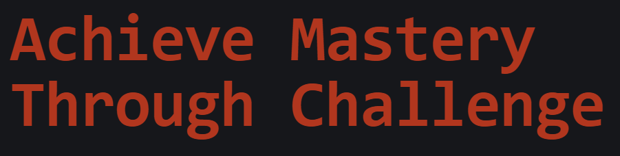

# Dom Manipulation Assignment

1. Webiste Name: [Dev To](https://dev.to/)

### Topics

    - Query Selctory, Inner HTML

### Sample Image


### Tasks

        Target the Top description div and change the DEV Community to <Your_Name> and description to your passion

### Output


# Answer


- code

```

document.querySelector(".side-bar .crayons-card .crayons-subtitle-2").innerHTML = "GK"

document.querySelector(".side-bar .crayons-card .color-base-70").innerHTML = "GK Rao write code"

```

#

2. Website Name: [Apple](https://support.apple.com/en-in)

### Task


### Fetch all the product name and store in an array

### Output

['iPhone', 'Mac', 'iPad', 'Watch', 'AirPods', 'Music', 'TV']

# Answer


- code

```

let array = [];
let list = document.querySelectorAll(".as-imagegrid-item-title")

for (let i=0; i<list.length; i++){
    document.querySelectorAll(".as-imagegrid-item-title .a11y")[i].innerHTML = " ";
    let ab = document.querySelectorAll(".as-imagegrid-item-title")[i].innerText;
    array.push(ab);
}

console.log(array);

```

#


3. Webiste Name: [Youtube Support](https://support.google.com/youtube/)

### Topics

    - Get Element By Id, Create Element, Create Text Node, Append Child

### Sample Image


### Tasks

     Add another FAQ 'My New FAQ' to the list

### Output


# Answer


- code
```

let newChild = document.createElement("section");
newChild.setAttribute("id", "uniqueid");
document.getElementsByClassName("accordion-homepage")[0].appendChild(newChild);

let secChild = document.createElement("h3");
secChild.setAttribute("id", "uniqueSecChild");
secChild.textContent = "My New FAQ";
document.querySelectorAll("#uniqueid")[0].appendChild(secChild);
```
#

4. Webiste Name: [OnePlus](https://www.oneplus.in/support)

### Topics

     Query Selector, InnerText

### Sample Image


### Tasks

      Change the contact number

### Output


# Answer


- code
```
document.querySelector(".one-tel-number").innerText= "+91 8722128796"
```


5. Webiste Name: [Samsung](https://www.samsung.com/in/offer/online/samsung-fest/)

### Topics

       getElementById, createElement, InnerText, append, setAttribute

### Sample Image


### Tasks

     Target the main div of card and change the Button text to Check out

### Output


# Answer


- code
```
document.getElementsByClassName(" diwali-deals-product-sale-btn  ")[24].innerText = "Check out";

```
#


6. Webiste Name: [Adidas](https://www.adidas.co.in/)

### Topics

    -   Query Selector, Event listeners, Changing Styles

### Sample Image


### Tasks

     Target the search box and on hover change thebackground color to red.

### Output


# Answer


- code
```
document.querySelector("input").style.background = "orange";

```
#

7. Webiste Name: [MDN Web Docs](https://developer.mozilla.org/en-US/)

### Topics

       Form, Value, Submit

### Sample Image


### Tasks

     To Search a topic in the MDN Search bar.
     First add a text to search in the search bar and then hit the submit search button to search the docs using DOM

### Output


# Answer


- code
```
document.getElementsByClassName("button action has-icon search-button")[1].click()

```
#

8. Webiste Name: [Google](https://www.google.com/)

### Topics

       Remove Elements

### Sample Image


### Tasks

     Remove alternate languages from the home page languages listed

### Output


# Answer


- code
```
let count = document.getElementById("SIvCob").querySelectorAll("a");

for( let i=0; i<count.length;
    i++){
        if (i%2==1){
            document.getElementById("SIvCob").querySelectorAll("a")[i].innerHTML= " " 
        }
    }
```
#

9. Webiste Name: [Code Wars](https://www.codewars.com/)

### Topics

       Change Font Family, Color of Text.

### Sample Image


### Tasks

    Change the font family of the text to monospace and text color to the logo’s background color.

### Output



# Answer


- code
```
document.querySelector("h1").style.fontFamily="monospace";
document.querySelector("h1").style.fontSize = "60px";
document.querySelector("h1").style.color="#b1361e";

```
#

10. Webiste Name: [Freecodecamp](https://www.freecodecamp.org/)

### Topics

       querySelector, mouseover, click eventListener,  callback function, style,

### Sample Image


### Tasks

    Target the button and change background colour on mouseover

### Output


# Answer


- code
```
document.getElementsByClassName("btn-cta-big")[0].addEventListener("mouseover", bgc)

function bgc(){
    document.getElementsByClassName("btn-cta-big")[0].style.background="red";
}

```
#

11. Webiste Name: [realme](https://www.realme.com/in/)

### Topics

       querySelector,style,background-image

### Sample Image


### Tasks

    change the realme logo to ineuron logo

### Output


# Answer


- code
```
document.getElementsByClassName("logo gtag")[0].innerHTML=" "
```
#

12. Webiste Name: [Github](https://github.com/)

### Topics

       querySelector,style,background-Color

### Sample Image


### Tasks

     change the background colour of the button to blue.

### Output


# Answer


- code
```
document.getElementsByClassName("btn btn-sm btn-primary btn mb-2")[0].style.background="orange";

```
#

13. Webiste Name: [Hackerrank](https://www.hackerrank.com/)

### Topics

       querySelector,innerHtml

### Sample Image


### Tasks

Target the top description and change “Matching developers with great companies” to ‘JSBOOTCAMP“.

### Output


# Answer


- code
```
document.getElementsByClassName("fl-heading-text")[0].innerHTML="JSBOOTCAMP"

```
#

14. Webiste Name: [Asus](https://www.asus.com/in/)

### Topics

      querySelector,style,font-size

### Sample Image


### Tasks

       change the fontsize of “Hot Deals” to 80px

### Output


# Answer


- code
```
document.querySelectorAll(".HotDealsAll__Heading__2fIbe")[0].style.fontSize="80px";
document.querySelectorAll(".HotDealsAll__Heading__2fIbe")[0].style.color="blue"

```
#

15. Webiste Name: [Dell](https://www.dell.com/en-in/shop/deals/laptop-deals?gacd=10415953-9016-5761040-285981356-0&dgc=ST&gclid=Cj0KCQjwguGYBhDRARIsAHgRm4-XUDMhhVNyHXb3s1gY4ZBzORr_d9Se-buhJwy7asyUe7YdqEA11eEaAt6UEALw_wcB&gclsrc=aw.ds&nclid=BxjBlpBQsX6pjSHh-L8YYSU77EpfXRkG1AGMB5Wbeu386ykspfrPDnfx_DdFau20)

### Topics

      querySelector,style.textAlign

### Sample Image


### Tasks

       Convert the text “G15 Gaming Laptop” from left to right

### Output


# Answer


- code
```
document.getElementsByClassName("col-md-6 ")[0].getElementsByClassName("mb-2 d-flex align-items-center flex-wrap")[0].style.justifyContent="end"

```
#

16. Webiste Name: [Vercel](https://vercel.com/)

### Topics

     querySelector,innerHTMl

### Sample Image


### Tasks

      change the heading “Start with the developer” to “Start with Scratch”

### Output


# Answer


- code
```
document.getElementsByClassName("section-title_title__VEDfK")[0].innerText= "Start with Scratch"
```
#

17. Webiste Name: [Sony](https://www.sony.co.in/)

### Topics

    querySelector,innerHTMl

### Sample Image


### Tasks

     change the button text To current Date.

### Output


# Answer


- code
```
document.getElementsByClassName("btn-container")[0].innerHTML= new Date()

```
#

18. Webiste Name: [Philips](https://www.philips.co.in/)

### Topics

     querySelector,style,backgroundcolor

### Sample Image


### Tasks

    change the background colour blue to orange

### Output


# Answer


- code
```
document.getElementsByTagName("footer")[0].style.background="orange";
```
#


19. Webiste Name: [Canon](https://in.canon/)

### Topics

          querySelector,src

### Sample Image


### Tasks

    extract the canon logo

### Output


# Answer


- code
 
```
console.log(window.location.href+document.getElementsByClassName("logo")[0].getAttribute("src"))
```
#


20. Webiste Name: [Oppo](https://www.oppo.com/in/)

### Topics

          querySelector,style,color

### Sample Image


### Tasks

      Change the description colour black to orange

### Output


# Answer


- code
```
document.getElementsByClassName("desc")[4].style.color="orange";
```
#
