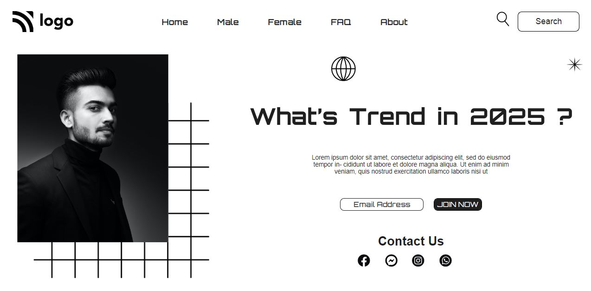

# **Gopalkrishna Rao**

## Live class projcet-1

***

## - [Netlify](https://lcproject1.netlify.app/) -deployed link
## -  [FindCoder.io](https://www.findcoder.io/u/hrgkrao) -Profile 

## -  [Github](https://github.com/GopalkrishaRao/WebDev/tree/main/LC%20Project%201) Source code

## -Approximate time taken to complete projct **2 days!**

# __Learnings from the project__

-   This is my first projcet and every code writtn is new to me as I am from livescience background.
- I got an idea that how css works!!
- Its exciting (* _ *) !!!

