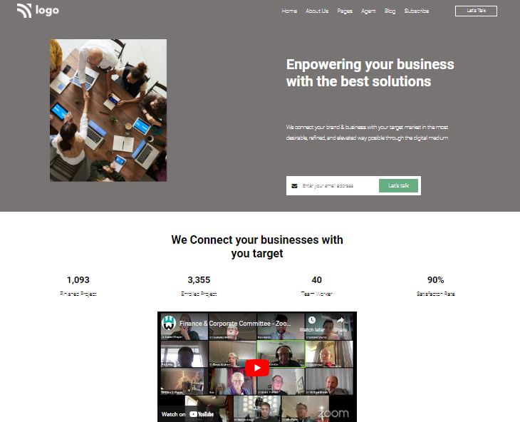

# **Gopalkrishna Rao**

## Live class projcet-12

***

## - [Netlify](https://lcproject12.netlify.app/) -deployed link

## -  [Github](https://github.com/GopalkrishaRao/WebDev/tree/main/LC%20Project%2012) Source code

## -  [FindCoder.io](https://www.findcoder.io/u/hrgkrao) -Profile 

## -Approximate time taken to complete projct **8 hours!**

# __Learnings from the project__

-   grid
- flex

