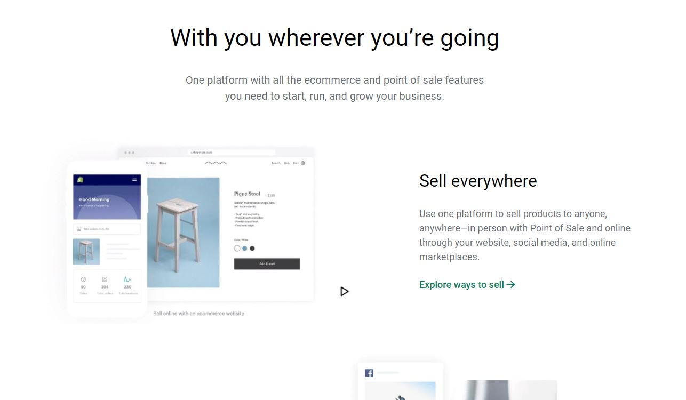
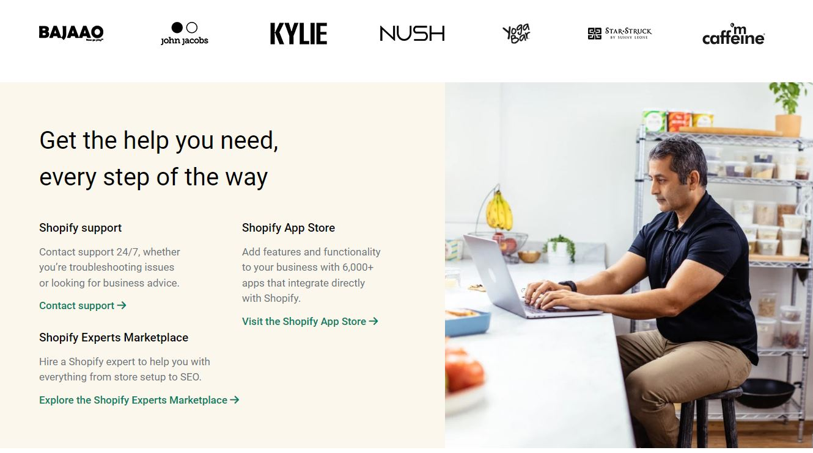

# **Gopalkrishna Rao**

## This is a clone of **`shopify.in`** made with html and tailwind css. The goal of making this project is to learn and practice tailwindcss.
#

## Live class projcet-Shopigy_clone

***
## - [Netlify](https://lcproject-shopifyclone.netlify.app/) -deployed link

## -  [Github](https://github.com/GopalkrishaRao/WebDev/tree/main/shofify_clone) Source code

## -  [FindCoder.io](https://www.findcoder.io/u/hrgkrao) -Profile 

## -Approximate time taken to complete projct **2 days!**.Although it took a while to finish, it was well worth  for newbie like me who don't have a background in coding.

# __Learnings from the project__

- Tailwind css

#
# Open for suggestions

## I'm new to the world of programming and coding. Your comments and suggestions will be greatly appreciated 

## - You can view all of my other works at  [FindCoder.io](https://www.findcoder.io/u/hrgkrao) 
## - You can drop a mail @  **`hrgkrao@gmail.com `**
## -  Get connected on [Linkedin](https://www.linkedin.com/in/h-r-gopalkrishna-rao-a2830216b/)
#

